# QBR Dashboard: Application Development Portfolio

**Submission format:** Approximately 2,000 words of narration plus supporting tables, figures, screenshots and technical artefacts
**Prepared:** 19 August 2026
**Narration word count:** 1,992 using the repository count; confirm in the final submission application
**Evidence boundary:** Representative-user testing was unavailable. No participant results, user acceptance, measured savings, genuine Safari result or WCAG conformance claim is made.

## Portfolio structure

| Section | Narration focus | Principal supporting artefacts |
|---|---|---|
| 1. Project Overview | Problem, audience, scope and value | Audience profiles and scope table |
| 2. Requirements Analysis | Functional and non-functional needs | Requirements and prioritised user stories |
| 3. Design and User Experience | UX rationale, accessibility and navigation | Implemented application states, user flow and mobile evidence |
| 4. Development Process | Technology, platform and architecture appraisal | Comparison tables, architecture diagram, code evidence and Git history |
| 5. Testing and Quality Assurance | Strategy, defects, results and code quality | Test matrix and five core evidence screenshots |
| 6. Deployment and Technical Implementation | Distribution, infrastructure, scalability and maintenance | Deployment and scalability table |
| 7. Business Impact and Value | Benefits, costs, alternatives and success measures | Cost-benefit, competitor and success-metric tables |
| 8. Critical Reflection | Learning, problem solving and future practice | Evidence-linked reflective examples |

# 1. Project Overview

Quarterly Business Reviews require information from several service areas to be converted into a concise account of performance, risk and ownership. In a spreadsheet-led process, inconsistent headings, units and status rules can create repetitive preparation and make it difficult for a reviewer to trace a warning back to its metric, owner or case. A visually convincing report can also be misleading when unlike measures are combined or when a higher value is incorrectly assumed to represent better performance.

The QBR Dashboard addresses this problem through a static browser application. It imports standardised CSV files for eight service categories, validates every row before persistence, applies direction-aware RAG logic, displays metric-separated charts and searchable records, and exports consolidated CSV and PDF reports. All processing occurs within the browser and the tested workflow made no cross-origin request. The product is intentionally a controlled prototype rather than a replacement for an enterprise business-intelligence platform.

The intended audience consists of a coordinator who prepares QBR material and a reviewer who investigates risk and accountability. These profiles are workflow-based design assumptions, not research-backed personas, because suitable participant access was unavailable within the project timeframe. Value is therefore expressed through implemented capabilities such as standardisation, traceability and local processing. Time savings, error-reduction percentages and financial returns are not claimed without a measured baseline.

## Artefact 1: Constructed personas

### Constructed persona 1: Sarah McLean

| Attribute | Detail |
|---|---|
| Status | Fictional constructed persona; not a real Cisco employee and not interviewed |
| Role | Customer Delivery Architect |
| Experience | 12 years in networking and customer delivery |
| Technical proficiency | Expert |
| Primary goals | Understand account and service health before customer business reviews; identify significant risks quickly; trace warnings to the responsible service, owner or case; produce consistent review material |
| Pain points | QBR information originates from several service areas; source files may use inconsistent structures; summary indicators can hide the metric that caused the warning; incorrect aggregation could lead to poor business decisions |
| Most relevant capabilities | Consolidated overview; RAG status; owner and case traceability; category drill-down; PDF export |

### Constructed persona 2: Daniel Reeves

| Attribute | Detail |
|---|---|
| Status | Fictional constructed persona; not a real Cisco employee and not interviewed |
| Role | Technical Consulting Engineer |
| Experience | 5 years in technical support and troubleshooting |
| Technical proficiency | Advanced |
| Primary goals | Identify technical risks and recurring service issues; search detailed records behind QBR summaries; connect performance information with case ownership and references |
| Pain points | Summary data may be separated from underlying support evidence; large datasets are difficult to interrogate manually; incorrect or incomplete imported data can undermine analysis |
| Most relevant capabilities | Searchable detailed records; date, category and status filtering; atomic CSV validation; owner and Case ID fields; CSV export |

### Constructed persona 3: Priya Shah

| Attribute | Detail |
|---|---|
| Status | Fictional constructed persona; not a real Cisco employee and not interviewed |
| Role | Network Consulting Engineer, SD-WAN |
| Experience | 8 years in enterprise networking |
| Technical proficiency | Expert |
| Primary goals | Understand technical performance across customer environments; compare individual measures without combining incompatible units; interpret targets correctly when some metrics are higher-is-better and others are lower-is-better |
| Pain points | Different metrics have different units, targets and meanings; higher values cannot automatically be assumed to represent better performance; aggregating percentages, counts and durations can create misleading summaries |
| Most relevant capabilities | Direction-aware RAG calculation; metric-separated trend series; targets and units; category detail; boundary-safe status calculation |

| Scope included | Scope excluded |
|---|---|
| Local CSV import, validation and normalisation | User accounts and role-based access |
| Eight configured QBR categories | Central database, collaboration or multi-device sync |
| Charts, filters, detailed records and exports | Organisational audit history and managed backup |
| Local persistence with previous-state recovery | Production deployment approval and domain-owner sign-off |

# 2. Requirements Analysis

Requirements were derived from the intended preparation and review workflow, inspection of the existing application, domain-risk analysis and defects discovered during testing. Must-have requirements focused on preserving business meaning as well as delivering visible features. This meant that invalid files had to fail atomically, status had to respect whether higher or lower was better, and unlike metrics could not be totalled simply because they were numeric.

Non-functional requirements addressed local processing, reliability, accessibility, responsiveness, maintainability and performance. Acceptance criteria were made observable so that they could be connected to automated tests or browser evidence. The requirements are implemented, but workplace terminology, target values and real metric rules still require domain-owner confirmation before operational use.

MoSCoW prioritisation separated decision-critical import, validation, status, filtering and export behaviour from supporting template and accessibility enhancements. Requirement IDs are retained in the evidence tables so implementation and test results can be traced without repeating their detail in the narration.

## Artefact 2: Functional requirements and implementation status

| ID | Priority | Requirement and acceptance criterion | Status | Evidence |
|---|---|---|---|---|
| FR-01 | Must | Import a CSV into any of eight categories using replace or append mode | Complete | Upload view and browser workflow |
| FR-02 | Must | Require Date, Category, Metric and Value headers | Complete | Parser regression tests |
| FR-03 | Must | Reject the complete file before persistence when any material row is invalid | Complete | Figure 7 and invalid fixture |
| FR-04 | Must | Validate real ISO dates and finite numeric values or targets | Complete | Parser tests and row-level messages |
| FR-05 | Must | Retain explicit RAG status or derive it only from a valid target and direction | Complete | Direction and zero-target tests |
| FR-06 | Must | Keep each metric and unit in a separate trend series | Complete | Chart tests and Figure 9 |
| FR-07 | Must | Filter inclusively by date and combine category and status filters | Complete | Filter tests and browser scenarios |
| FR-08 | Must | Persist accepted data transactionally and recover a valid previous state | Complete | Store rollback and recovery tests |
| FR-09 | Must | Display category summaries, charts and searchable detailed records | Complete | Overview and category-detail checks |
| FR-10 | Must | Export complete consolidated CSV and PDF outputs | Complete | Export tests and three-engine workflow |
| FR-11 | Should | Provide semantic data alternatives for every canvas chart | Complete | Three charts and three adjacent tables |
| FR-12 | Should | Provide templates, clear actions and explicitly labelled demo data | Complete | Settings, empty-state and demo checks |

## Artefact 3: Non-functional requirements

| ID | Quality attribute | Requirement | Result and limitation |
|---|---|---|---|
| NFR-01 | Privacy | Process imported data without an application server | Passed in tested workflow; not an organisational security approval |
| NFR-02 | Reliability | Preserve existing state when parsing or storage fails | Passed through atomic rejection and rollback tests |
| NFR-03 | Accessibility | Support keyboard use, visible focus, text status and chart alternatives | Implemented; no WCAG conformance or screen-reader claim |
| NFR-04 | Responsiveness | Remain usable at a 390-pixel viewport | Passed mobile navigation checks |
| NFR-05 | Compatibility | Complete the core workflow in multiple browser engines | Passed Chromium 151, Firefox 153 and WebKit 26.5; WebKit is not Safari |
| NFR-06 | Performance | Keep a 1,000-row local workflow responsive | Median import 56.4 ms, render 175.4 ms and filter 48.4 ms; baseline only |
| NFR-07 | Maintainability | Separate parsing, storage, filters, charts, tables, upload and export | Achieved through focused IIFE modules; ordered globals remain a scaling weakness |
| NFR-08 | Offline operation | Avoid runtime CDN dependencies | Achieved through locally bundled libraries |

## Artefact 4: Prioritised user stories

Every story is a design assumption because external user validation was unavailable.

| Story | Priority | As a... | I need... | So that... | Acceptance evidence |
|---|---|---|---|---|---|
| US-01 | Must | Coordinator | a category template | source files use the required schema | Eight template actions |
| US-02 | Must | Coordinator | row-specific validation | source errors can be corrected before storage | Invalid fixture rejection |
| US-03 | Must | Coordinator | replace and append modes | periodic files can be refreshed predictably | Upload mode control |
| US-04 | Must | Reviewer | category and RAG summaries | at-risk areas can be identified quickly | KPI and status charts |
| US-05 | Must | Reviewer | date, category and status filters | the review can focus on a relevant period or risk | Combined filter tests |
| US-06 | Must | Reviewer | owner and case fields beside metrics | a warning can be traced to accountability | Detailed table |
| US-07 | Must | Reviewer | separate metric trends | incompatible values are not mistaken for a meaningful total | Chart transformation tests |
| US-08 | Must | Reviewer | complete CSV and PDF exports | evidence can be shared without re-keying | Export regression tests |
| US-09 | Should | Keyboard user | visible focus and controllable mobile navigation | the core interface is operable without a pointer | Keyboard browser checks |
| US-10 | Should | Assistive-technology user | structured chart-data tables | values are not available only as canvas pixels | Figure 9 and semantic tables |

# 3. Design and User Experience

The design uses a summary-to-evidence hierarchy. The overview presents independent category status, category detail separates metric trends and RAG distribution, and the record table exposes dates, targets, owners and case references. This supports recognition and progressive disclosure instead of showing the full dataset at once. A persistent desktop sidebar becomes an overlay drawer at narrow widths, retaining the same category and workspace structure rather than introducing a different mobile information architecture.

Error prevention received greater priority than decorative complexity. Invalid imports report CSV row numbers and reasons, preserve existing data and reject the entire file before any partial chart is shown. Templates and the schema reference reduce memory demand, while explicitly labelled demonstration data avoids confusion with live information. These decisions apply visibility, consistency, prevention and recovery principles associated with heuristic evaluation (Nielsen, 1994).

The colour palette uses deep navy for navigation, blue for actions and labelled red, amber and green states. RAG meaning is never communicated by colour alone. Typography uses the system font stack to avoid an external font request and to retain familiar platform rendering. Accessibility decisions target keyboard operation, focus visibility, labels, status messages and reflow in WCAG 2.2 (W3C, 2024). Since Chart.js canvas content is not inherently exposed to screen readers, each named canvas has an adjacent captioned data table (Chart.js, 2025).

Representative testing could have identified terminology, recovery or interpretation problems that expert inspection cannot reliably detect. Participant access limitations prevented this work, so no user quotations, ratings, task success or feedback-led iteration are claimed. The captured application states and implemented changes are presented as design and test evidence rather than user-validated research.

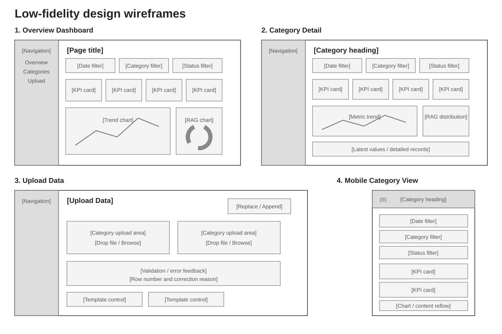

*Artefact: Low-fidelity design wireframes documenting the dashboard information architecture. These retrospective drawings document the structure represented by the implemented application; they are not claimed as pre-development evidence.*

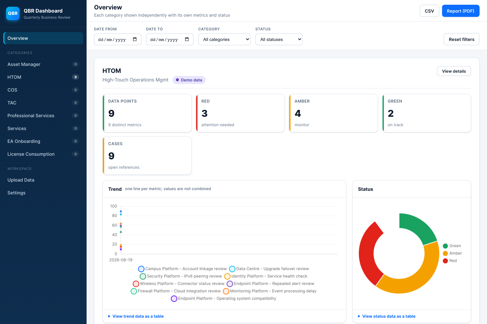

*Figure 1a. Implemented overview showing category status, summary measures and metric-separated charts.*

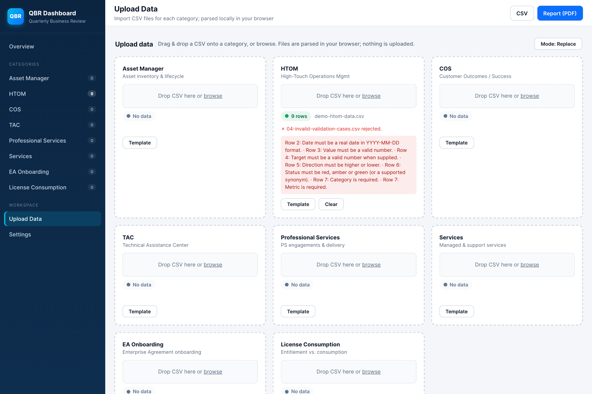

*Figure 1b. Implemented upload validation showing the invalid fixture rejected while the existing nine HTOM rows are preserved.*

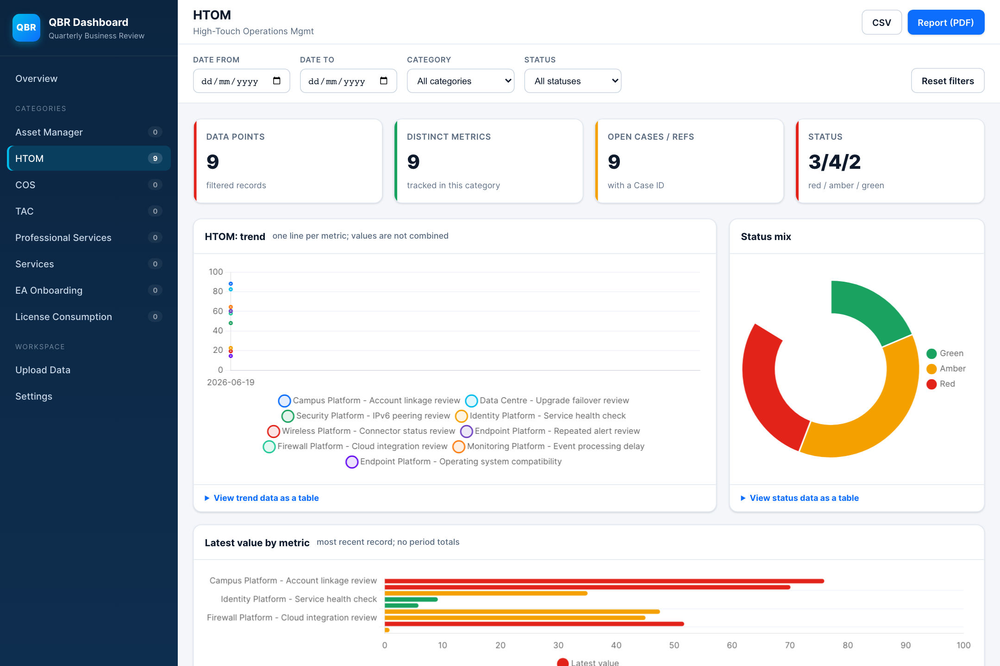

*Figure 1c. Implemented category detail showing summary measures, metric trends, status distribution and latest values.*

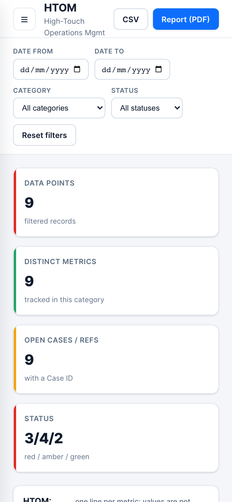

*Figure 1d. Implemented category detail at a 390-pixel viewport, with controls and summary measures reflowed for mobile use.*

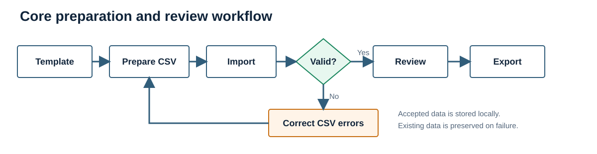

*Figure 2. Core preparation and review flow, including correction and re-import after atomic rejection.*


*Figure 3. Responsive navigation at 390 by 844 pixels. Keyboard opening, focus entry, Escape closure and focus return were also checked across three engines.*

# 4. Development Process

A static web platform was selected because the workflow is file-based, requires no shared live database and must run on common desktop operating systems. HTML supplies semantic structure, CSS handles responsive presentation and JavaScript performs validation, transformation and interaction. The same source can be served on macOS, Windows or Linux, while locally bundled libraries remove a runtime internet dependency.

Vanilla JavaScript was proportionate to the number of views and absence of a remote API. React or Vue could offer component boundaries, build tooling and stronger large-team conventions, but would add dependency and migration overhead without resolving the main domain risks. The IIFE modules separate concerns clearly, although reliance on global objects and ordered script loading would become a maintainability constraint if the product gained concurrent developers, remote services or frequent releases.

Specialist libraries were used where rebuilding mature behaviour would increase risk. PapaParse handles quoted CSV fields and tolerant parsing; Chart.js provides responsive charts; DataTables supplies search, sort and pagination; and jsPDF with AutoTable creates client-side reports. This shortens development but transfers responsibility for dependency review, lifecycle management and accessibility adaptation. DataTable and Chart instances are therefore destroyed before rerendering, and canvas charts receive structured alternatives.

The client-side platform was compared with native, hybrid, hosted and business-intelligence alternatives. A native desktop product would improve operating-system file integration but add packaging and update channels. A mobile application would not suit dense report preparation. A hybrid wrapper would reuse web code but add build complexity. A hosted service or BI platform would provide authentication, collaboration and central governance, but would require approved infrastructure, data-transfer controls and potentially licensing or vendor lock-in. The selected approach is therefore appropriate for a bounded prototype, not universally superior.

Development became increasingly test-led. Initial logic assumed higher values were better, so incident-style measures and zero targets could receive false green status. The schema gained an explicit Direction field and safe boundary logic. Mixed metrics were removed from totals and keyed into separate series. Storage updates became transactional with previous-state recovery. The PDF row limit was removed, spreadsheet-formula-like CSV values were neutralised, and demo data became explicit opt-in content. These changes demonstrate progression from visible functionality to semantic correctness and recoverable failure.

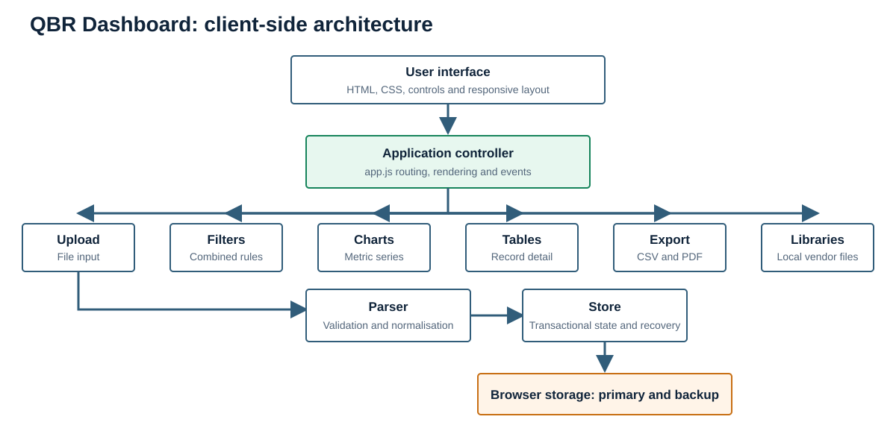

*Figure 4. Client-side module architecture. The application orchestrator coordinates focused modules, while accepted state is persisted to a primary and previous-state browser key.*

## Artefact 5: Platform and framework appraisal

| Option | Strengths for this context | Weaknesses for this context | Decision |
|---|---|---|---|
| Static web application | Portable, inspectable, offline-capable and no installation package | Origin-specific local storage and no central governance | Selected for the bounded prototype |
| React or Vue web application | Components, ecosystem and scalable build tooling | Build and dependency overhead for a small local application | Deferred until complexity justifies migration |
| Native desktop | Strong file and OS integration | Separate packaging, signing and update distribution | Rejected for current scope |
| Native mobile or hybrid | Touch support and possible app-store distribution | Dense QBR tables are desktop-oriented; wrapper complexity | Rejected for primary workflow |
| Hosted web service | Authentication, backup, collaboration and auditability | Infrastructure, security, governance and hosting requirements | Appropriate if shared operation becomes mandatory |
| BI platform | Managed analytics and organisational integration | Licensing, vendor lock-in and reduced control over unique validation rules | Operational alternative, not selected for the development portfolio |

## Artefact 6: Representative code decision

The status function refuses to guess when target or direction is absent and handles zero targets explicitly.

```javascript
function deriveStatus(value, target, direction) {
  if (value == null || target == null || !direction) return '';
  if (direction === 'higher') {
    if (target === 0) return value >= 0 ? 'green' : 'red';
    if (value >= target) return 'green';
    return value >= target * 0.8 ? 'amber' : 'red';
  }
  if (direction === 'lower') {
    if (target === 0) return value <= 0 ? 'green' : 'red';
    if (value <= target) return 'green';
    return value <= target * 1.25 ? 'amber' : 'red';
  }
  return '';
}
```

## Artefact 7: Version-control and CI evidence

| Evidence | Verified fact | Critical interpretation |
|---|---|---|
| `59d679d` | Initial project import | Establishes the repository baseline |
| `0e316b5` | Dashboard scaffold commit | Shows a separate scaffold stage |
| `cbb41b1` | Reconstructed-history branch merged into `main` | History exists but is less granular than an ideal requirement-linked sequence |
| Final release commit | `df32727b765e5bea64f972e0ca83244672ea502c` on `main` | Records the application, portfolio and automated release publication state |
| GitHub Actions workflow | `QBR Dashboard Tests`, run 3, completed successfully on 19 August 2026 | The remote `Run regression tests` step passed for the final release commit; the local suite reported 20/20 |
| Release evidence | Annotated tag `v1.1.0`, `CHANGELOG.md` and GitHub Release published with Word and PDF assets | Improves traceability, but the historical commit sequence remains less granular than an ideal requirement-linked history |

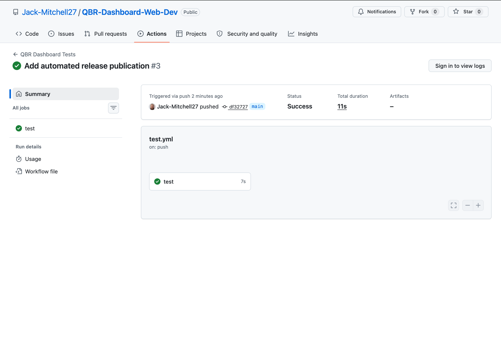

*Figure 5. GitHub Actions run 3 completed successfully for commit df32727 on main. The test job passed remotely before the v1.1.0 release was published.*

# 5. Testing and Quality Assurance

Testing combined pure-logic regression tests with browser workflows, negative fixtures, accessibility scanning and performance measurements. The Node.js test runner was suitable because it is stable, dependency-light and returns a failing process status when assertions fail (Node.js contributors, n.d.). Twenty tests cover parser boundaries, metric transformations, filters, transactional storage, backup repair and export completeness. Browser checks then verify rendering, downloads, focus and library integration that the pure harness cannot exercise.

The most valuable tests challenged meaning rather than appearance. Invalid files were rejected atomically; lower-is-better and zero-target status branches were verified; unlike units remained separate; failed persistence preserved previous state; and a 45-row export helper proved that the historical PDF limit had been removed. CSV fields beginning with spreadsheet formula markers are prefixed as a risk reduction, while OWASP guidance is acknowledged that no mitigation is universal for every spreadsheet consumer (OWASP Foundation, n.d.).

The same 48-row workflow passed in Chromium 151, Firefox 153 and WebKit 26.5 with no captured page error, console error or external request. Twelve axe-core scans initially found supporting-text and transient toast contrast failures. Both were corrected, after which final scans reported zero automatically detected violations. This does not establish WCAG conformance. Five Chromium runs with 1,000 rows established local medians of 56.4 ms for import, 175.4 ms for detail rendering and 48.4 ms for filtering.

## Artefact 8: Test strategy and results

| Level | Scope | Quantity | Result | Limitation |
|---|---|---:|---|---|
| Parser regression | Headers, dates, numbers, enums, direction and zero targets | 7 tests | Pass | Pure harness, not browser file control |
| Chart regression | Metric separation, duplicates, latest values and RAG roll-up | 4 tests | Pass | Canvas rendering checked separately |
| Filter regression | Date boundaries, combined filters and reset | 3 tests | Pass | Uses representative fixtures |
| Store regression | Persistence, rollback, recovery and clear-all | 4 tests | Pass | In-memory storage harness |
| Export regression | CSV protection and complete PDF body mapping | 2 tests | Pass | File download checked in browsers |
| Browser integration | End-to-end views and actions | 15 scenarios | Pass | Controlled workflow, not organisational acceptance |
| Accessibility automation | Four views across three engines | 12 scans | Zero final detected violations | Manual screen-reader testing unavailable |
| Performance | 1,000-row import, render and filter | 5 runs | Responsive local baseline | No agreed production threshold |

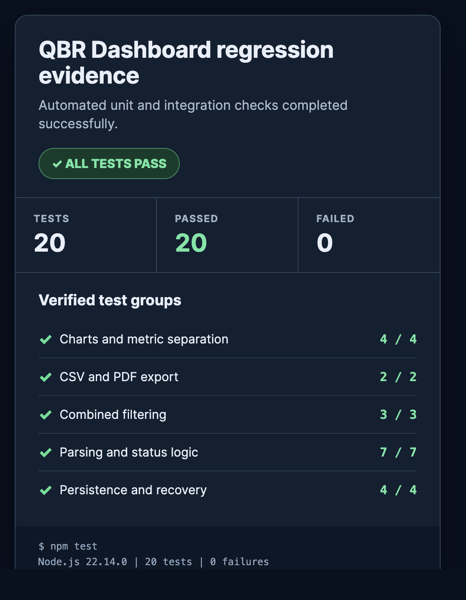

*Figure 6. Automated regression evidence: 20 tests passed with zero failures or skips.*

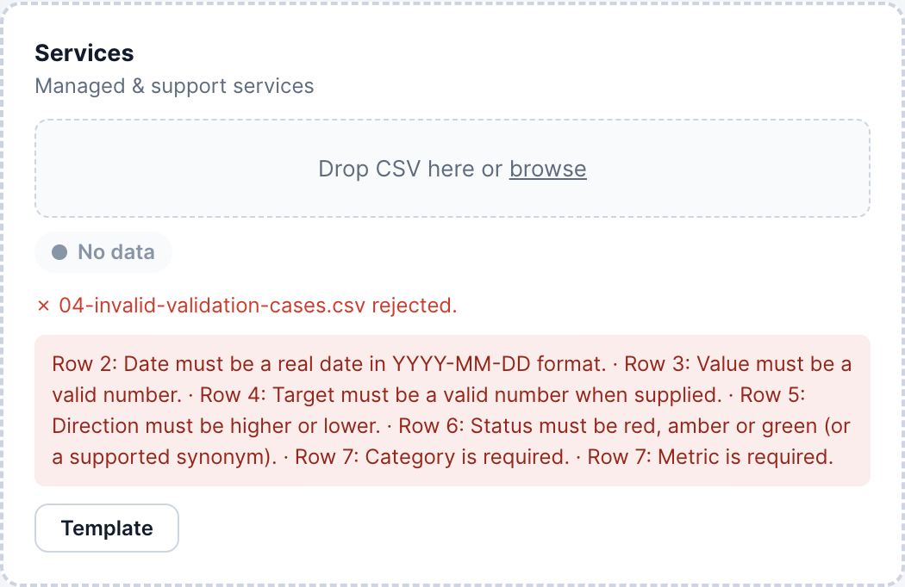

*Figure 7. Negative testing: invalid date, value, target and direction data was rejected before persistence.*

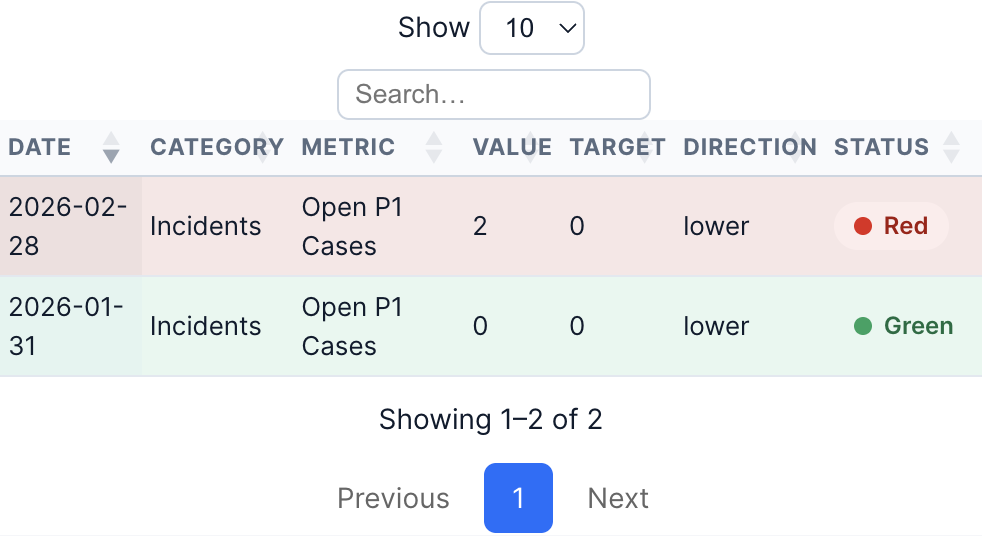

*Figure 8. Boundary testing: zero meets a zero lower target, while a positive value against it is red.*

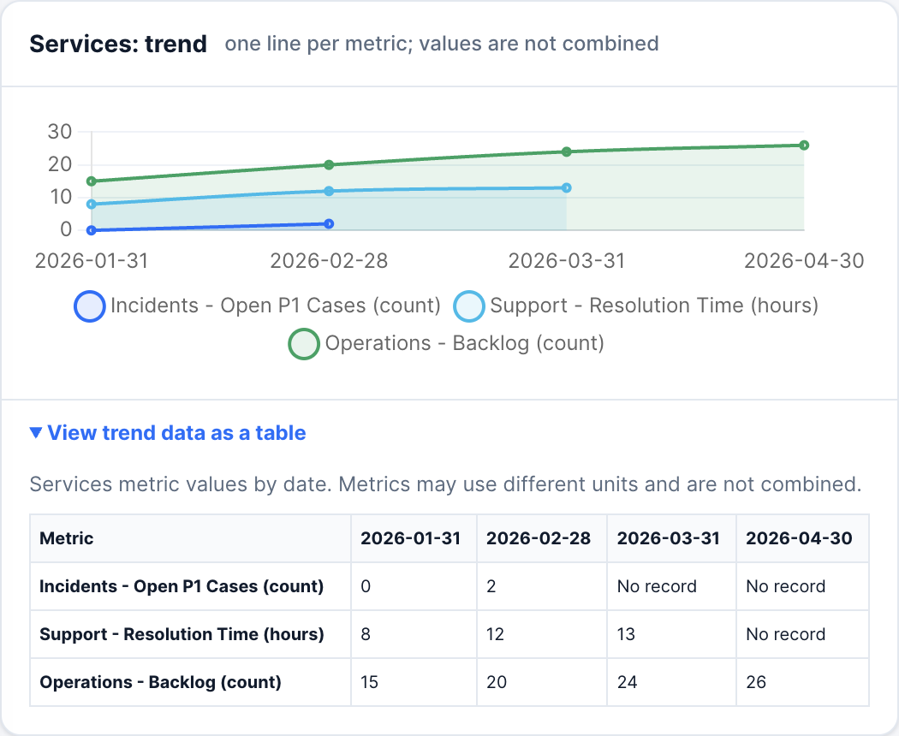

*Figure 9. Unlike metrics remain separate and the chart has an expandable semantic data alternative.*

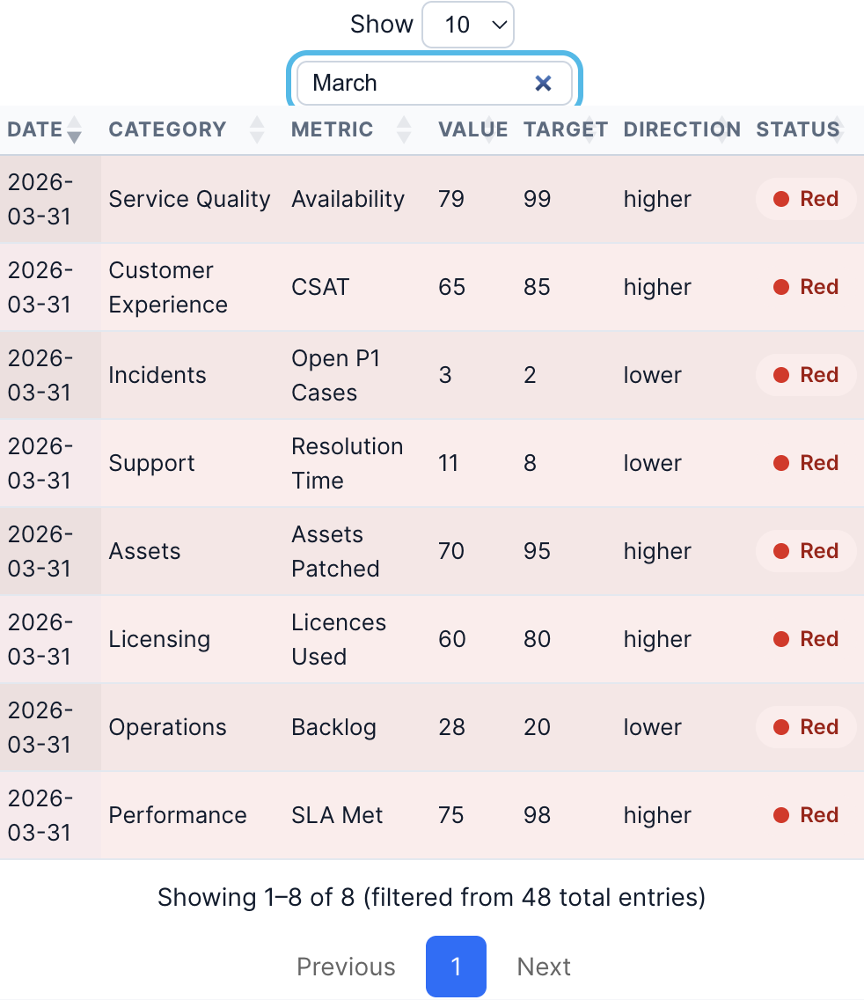

*Figure 10. Searching the 48-row fixture for March returned the expected eight detailed records.*

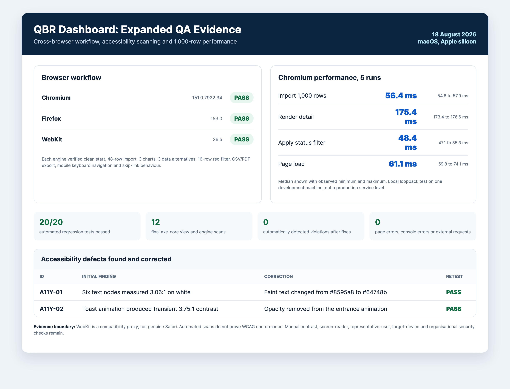

*Figure 11. Three-engine workflow results, corrected contrast defects and five-run performance medians.*

# 6. Deployment and Technical Implementation

The application is distributed as static files with platform launchers and no production build step. A local HTTP origin is preferred because `localStorage` is origin-specific and direct file behaviour varies between browsers (MDN contributors, 2026). Vendor libraries are bundled, so runtime operation does not require a CDN. The recipient can use the supplied macOS, Windows or Linux launcher, while the Quick Start document explains import, backup and troubleshooting.

This approach scales operationally only to the storage, processing power and browser profile of one device. Increasing row volume can be measured, but increasing users creates isolated copies rather than a shared service. A hosted architecture would be required for authentication, central backup, audit history and concurrent use. Maintenance currently involves dependency review, regression execution, browser checks and clear release notes. The final `main` commit passed the remote GitHub Actions regression workflow before the annotated `v1.1.0` tag and GitHub Release were published.

## Artefact 9: Deployment, scalability and maintenance

| Concern | Current implementation | Scaling or maintenance implication |
|---|---|---|
| Distribution | Static folder and three platform launchers | Simple handover; no automatic updater |
| Hosting | Loopback HTTP server | No external hosting service in tested mode |
| Data storage | Browser `localStorage` plus previous-state backup | Device and origin specific; no shared recovery |
| Runtime dependencies | Libraries bundled in `vendor` | Offline-capable, but versions require periodic review |
| More data | Browser-side parse, render and storage | Re-run thresholds on target device and maximum expected volume |
| More users | Independent browser profiles | Requires hosted authentication and central data services |
| Release quality | Final `main` commit `df32727`; local 20/20 tests; successful remote workflow run 3; annotated `v1.1.0` tag; changelog and GitHub Release | Verified release evidence, while production approval and stakeholder acceptance remain unavailable |

# 7. Business Impact and Value

The dashboard's immediate value is structural rather than a proven financial return. It standardises the input schema, rejects materially invalid files, preserves metric direction and unit, connects summary status to detailed ownership, and produces consistent exports. Local processing also reduces application-driven data transfer during the tested workflow. These capabilities can support faster preparation and fewer interpretation errors, but those outcomes were not measured and are therefore framed as hypotheses.

The main alternative is a spreadsheet-based process, which is flexible and familiar but can duplicate validation, formatting and chart work. A commercial BI platform provides stronger collaboration, governance and support but can add licensing, configuration and vendor dependence. A custom hosted service would improve multi-user operation but require security, authentication and infrastructure. The QBR Dashboard occupies a low-infrastructure prototype niche: more controlled than manual spreadsheet assembly but less governed than an enterprise platform.

A cost-benefit assessment cannot responsibly assign cash values without current preparation time, salary rates, error costs, usage frequency and maintenance effort. The table therefore distinguishes observed implementation facts from measurements needed in a future organisational evaluation. This is stronger than presenting unsupported savings.

Growth potential depends on governance needs. Confirmed demand for shared access could justify authentication, central storage and managed deployment, while approved data connectors could reduce manual file preparation. These investments should follow evidence of adoption rather than being added speculatively to the prototype.

## Artefact 10: Cost-benefit framework without invented values

| Factor | Current cost or benefit evidence | Monetary estimate | Data required for valuation |
|---|---|---|---|
| Development | Existing project work and maintenance time | Not measured | Actual hours and agreed labour rate |
| Local hosting | No separate hosting service in tested mode | No external hosting charge evidenced | Device, support and operational overhead |
| Libraries | Bundled project dependencies | No paid licence cost documented | Formal licence and procurement review |
| Maintenance | Regression, browser and dependency checks required | Not measured | Release frequency and support ownership |
| Preparation efficiency | Consolidated import, filters and exports implemented | Benefit not measured | Before/after task timing |
| Error reduction | Atomic validation and semantic tests implemented | Benefit not measured | Baseline and post-adoption error counts |
| Traceability | Owner, case, target and metric retained together | Qualitative benefit evidenced | Operational audit requirements |
| Data transfer | No external request captured in tested workflow | Risk reduction, not cash saving | Organisational security valuation |

## Artefact 11: Alternative solutions

| Alternative | Advantage | Disadvantage compared with this prototype |
|---|---|---|
| Manual spreadsheet workbook | Familiar and highly flexible | Repeated validation, aggregation and presentation remain manual |
| Commercial BI platform | Collaboration, governance and vendor support | Licensing, setup and less control over bespoke CSV rules |
| Custom hosted application | Central data, authentication and audit history | Infrastructure, security and ongoing service ownership |
| QBR Dashboard | Local, portable, transparent and tailored validation | No central collaboration, governance or validated user outcomes |

## Artefact 12: Success measures and current evidence

| Measure | Method | Current result | Interpretation |
|---|---|---|---|
| Functional regression | Automated test pass rate | 20/20 passed | Strong repeatable logic evidence |
| Invalid-import safety | Persisted rows after invalid fixture | 0 rows | Atomic rejection achieved |
| Browser workflow | Engines completing standard scenario | 3/3 | Chromium, Firefox and WebKit proxy passed |
| Automated accessibility | Final detected violations | 0 across 12 scans | Positive automated result, not conformance |
| 1,000-row import | Five-run median | 56.4 ms | Responsive on recorded development machine |
| 1,000-row detail render | Five-run median | 175.4 ms | Responsive on recorded development machine |
| User task success | Representative observation | Not measured | Participant access unavailable |
| Preparation time or savings | Before/after workplace baseline | Not measured | No efficiency or ROI claim permitted |

# 8. Critical Reflection

The most significant learning was that visible completeness is not the same as decision quality. Early development concentrated on upload, charts, tables and exports, but testing exposed that the application could display a polished yet incorrect conclusion. The higher-is-better assumption suited availability but reversed measures such as incident count or resolution time. A positive value against a zero lower target could even become green. Introducing Direction, refusing to derive status without a valid rule and testing zero-target boundaries shifted the focus from presentation to semantic correctness.

A similar lesson came from aggregation. Combining numeric values looked convenient, yet percentages, hours and counts do not form a meaningful total. Replacing the total with a data-point count and keying trend series by metric and unit demonstrated that mathematically valid operations can still be analytically wrong. Future projects should define the unit, direction, target owner and worked examples for each measure before visualisation begins.

Failure evidence improved the process. Forced storage and corrupt-state cases led to rollback and backup repair, while export tests exposed the historical row limit and formula risk. Accessibility scans found two contrast defects, which were corrected and rescanned. An apparent WebKit focus failure proved to be a pointer-based test-method issue; repeating the interaction with keyboard focus and Enter verified the intended behaviour. The test method therefore required scrutiny alongside the code.

The modular structure and dependency-free Node tests made domain rules easier to isolate, while multi-engine checks covered integration behaviour. However, browser-heavy branches remain less covered by the pure harness, the historical commit sequence is less granular than an ideal requirement-linked history, and expert evaluation cannot replace user observation. Representative testing would have improved confidence in terminology, recovery and interpretation, but access was unavailable. Recording this limitation is more professionally credible than inventing feedback.

If repeated, semantic criteria and fixtures would precede interface work, commits would be smaller and linked to requirement IDs, and deployment constraints would be agreed earlier. Quality is now understood as correct meaning, recoverable failure, accessible operation, traceable evidence and explicit limits. This makes residual risk visible to technical and business stakeholders.

# References

Chart.js (2025) *Accessibility*. Available at: https://www.chartjs.org/docs/latest/general/accessibility.html (Accessed: 18 August 2026).

MDN contributors (2026) *Window: localStorage property*. MDN Web Docs. Available at: https://developer.mozilla.org/en-US/docs/Web/API/Window/localStorage (Accessed: 18 August 2026).

Nielsen, J. (1994) 'Enhancing the explanatory power of usability heuristics', in *Proceedings of the SIGCHI Conference on Human Factors in Computing Systems*. New York: ACM, pp. 152-158. doi: 10.1145/191666.191729.

Node.js contributors (n.d.) *Test runner*. Node.js documentation. Available at: https://nodejs.org/api/test.html (Accessed: 18 August 2026).

OWASP Foundation (n.d.) *CSV Injection*. Available at: https://owasp.org/www-community/attacks/CSV_Injection (Accessed: 18 August 2026).

World Wide Web Consortium (W3C) (2024) *Web Content Accessibility Guidelines (WCAG) 2.2*. W3C Recommendation, 12 December. Available at: https://www.w3.org/TR/WCAG22/ (Accessed: 18 August 2026).
