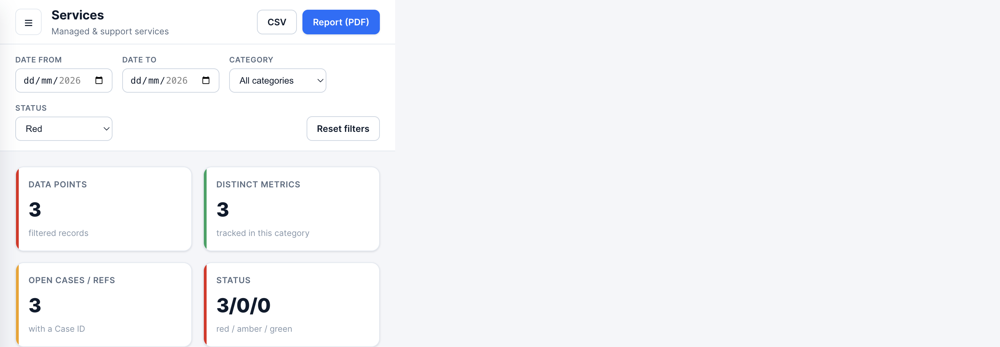
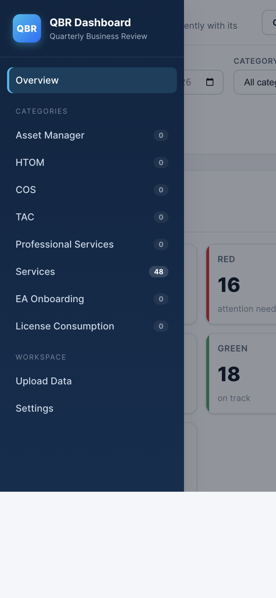

# QBR Dashboard test evidence caption register

## Evidence summary

- **Evidence date:** 18 August 2026
- **Application:** QBR Dashboard stylesheet revision 10
- **Environment:** macOS, local HTTP server, Chromium 151, Firefox 153 and WebKit 26.5
- **Automated runtime:** Node.js 22.14.0
- **Automated result:** 20 passed, 0 failed, 0 skipped
- **Result:** All recorded checks passed

The screenshots provide traceable evidence for automated regression, validation, status calculation, analytical accuracy, accessibility, filtering, larger datasets and responsive navigation. They demonstrate system testing only and do not claim stakeholder acceptance or user acceptance testing.

## Recommended five-image submission

If the portfolio permits only five images, use these:

1. `01-automated-regression-20-pass.png`
2. `02-invalid-upload-atomic-rejection.png`
3. `03-lower-direction-zero-target.png`
4. `04-chart-accessible-data-table.png`
5. `06-large-dataset-search-filter.png`

Images 05, 07 and 08 are supplementary evidence for filtering, responsive behaviour and expanded QA.

---

## EV-01: Automated regression suite

| Field | Evidence |
| --- | --- |
| Requirement | Core parsing, status, chart, filtering, export and storage behaviour must remain correct after changes. |
| Test input | `npm test`, running `node --test tests/*.test.cjs`. |
| Expected result | All 20 automated tests pass with no failures. |
| Actual result | 20 tests passed and 0 failed across charts, exports, filters, parsing and persistence. |
| Outcome | **PASS** |
| Portfolio caption | Automated regression testing verified 20 critical behaviours, including metric separation, safe exports, direction-aware status logic and storage recovery. All tests passed. |

## EV-02: Invalid CSV rejection

| Field | Evidence |
| --- | --- |
| Requirement | Invalid CSV rows must be rejected with useful feedback and must not partially overwrite valid application state. |
| Test input | `test-data/04-invalid-validation-cases.csv`, uploaded to Services in Replace mode. |
| Expected result | The file is rejected, row-specific validation messages are displayed and Services remains at zero rows. |
| Actual result | The app rejected the file and reported invalid date, number, target, direction, status and required-field errors. The card continued to show `No data`. |
| Outcome | **PASS** |
| Portfolio caption | Negative testing confirmed atomic CSV validation. Invalid rows were rejected with specific corrective messages and no partial data was stored. |

## EV-03: Lower-is-better and zero-target logic

| Field | Evidence |
| --- | --- |
| Requirement | Status calculation must respect the `lower` direction and handle a zero target safely. |
| Test input | `test-data/02-valid-lower-is-better.csv`, filtered to the Incidents category. |
| Expected result | `0` against target `0` is Green; `2` against target `0` is Red. |
| Actual result | Both expected states are shown, with the relevant Date, Category, Metric, Value, Target, Direction and Status fields visible. |
| Outcome | **PASS** |
| Portfolio caption | Boundary testing verified the corrected lower-is-better algorithm. A zero value meets a zero target, while a positive value against that target is correctly marked red. |

## EV-04: Metric separation and accessible chart alternative

| Field | Evidence |
| --- | --- |
| Requirement | Metrics with unlike units must not be totalled together, and chart information must have a text-based table alternative. |
| Test input | `test-data/02-valid-lower-is-better.csv`. |
| Expected result | Incidents, resolution time and backlog appear as separate series. Expanding the chart details presents the same values in a structured table. |
| Actual result | Three labelled metric series are displayed separately and the expanded accessible table reproduces their dated values, including missing-record states. |
| Outcome | **PASS** |
| Portfolio caption | Analytical and accessibility testing confirmed that unlike metrics remain separate and that the chart has an equivalent expandable data table. |

## EV-05: Combined status filtering

| Field | Evidence |
| --- | --- |
| Requirement | Dashboard filters must update the displayed analytical summary consistently. |
| Test input | `test-data/02-valid-lower-is-better.csv` with the global Status filter set to Red. |
| Expected result | Three matching records remain and the status summary becomes `3/0/0`. |
| Actual result | Data Points shows 3 and Status shows `3/0/0`, matching the selected Red filter. |
| Outcome | **PASS** |
| Portfolio caption | Filter testing confirmed that the selected red status is applied consistently to the category summary and record totals. |

## EV-06: Larger dataset search and filtering

| Field | Evidence |
| --- | --- |
| Requirement | The detailed table must remain usable with a larger dataset and return accurate search results. |
| Test input | `test-data/05-valid-large-48-rows.csv`, with the detailed-table search set to `March`. |
| Expected result | Eight March records are shown from the original 48-row dataset. |
| Actual result | The table reports `Showing 1–8 of 8 (filtered from 48 total entries)` and displays all eight March rows. |
| Outcome | **PASS** |
| Portfolio caption | Volume and search testing used a 48-row fixture. Searching for March returned the expected eight records while preserving clear status and direction information. |

## EV-07: Responsive mobile navigation

| Field | Evidence |
| --- | --- |
| Requirement | Navigation must remain available and understandable on a narrow mobile viewport. |
| Test input | Overview page at a 390 by 844 browser viewport with the navigation control activated. |
| Expected result | The sidebar becomes an overlay drawer, remains readable and exposes all categories and workspace actions. |
| Actual result | The drawer opens over a dimmed dashboard, highlights Overview and shows category row counts plus Upload Data and Settings. |
| Outcome | **PASS** |
| Portfolio caption | Responsive testing at mobile width confirmed that primary navigation changes into an accessible overlay drawer without losing category or workspace actions. |

## EV-08: Expanded cross-browser, accessibility and performance QA

| Field | Evidence |
| --- | --- |
| Requirement | Core workflows must be checked beyond one browser, accessibility defects must be scanned and corrected, and a repeatable larger-data performance baseline must be recorded. |
| Test input | The 48-row fixture in Chromium 151, Firefox 153 and WebKit 26.5; four axe-core views per engine; a generated valid 1,000-row fixture across five Chromium runs. |
| Expected result | The workflow passes in each engine, final automated scans report no detected violation, and measured actions complete without runtime failure. |
| Actual result | All three engines passed the workflow. Twelve final scans reported zero detected violations after two contrast fixes. Median import, detail-render and filter timings were 56.4 ms, 175.4 ms and 48.4 ms. |
| Outcome | **PASS WITH EXPLICIT LIMITATIONS** |
| Portfolio caption | Expanded QA verified the same import, chart, filter, export and keyboard workflow in Chromium, Firefox and WebKit. Two contrast defects were corrected, final automated scans reported no detected violation, and five 1,000-row runs established a local performance baseline. WebKit is not claimed as genuine Safari and automated scans do not prove WCAG conformance. |

## Submission note

The five recommended core images provide breadth rather than repeating similar table views. They cover automated quality assurance, negative validation, boundary logic, analytical accessibility and larger-data filtering. Use the supplementary filtering, mobile and expanded-QA images when the portfolio format allows more evidence. EV-08 is particularly useful beside a QA section because it adds Firefox, WebKit, accessibility-defect and performance evidence in one legible figure.
